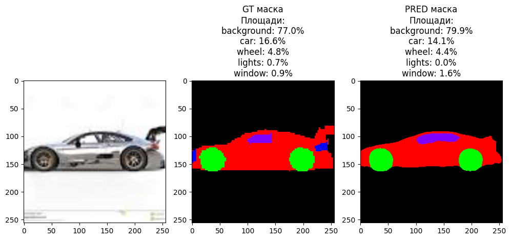
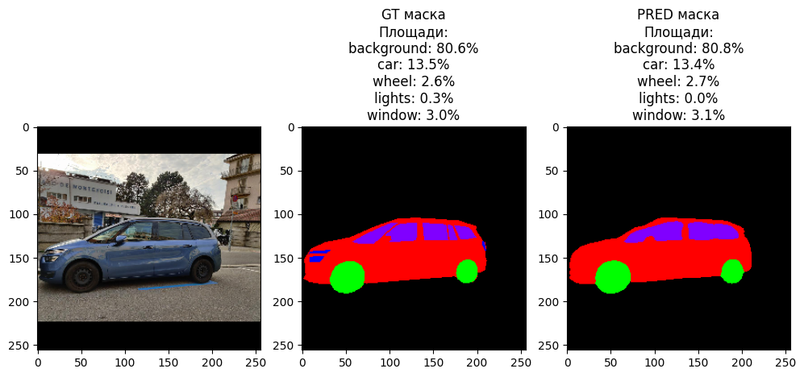

# Classification of the Simpsons
---
The application is designed for editing a car: changing the color of the body, lights, windows and wheels.

Link to the website - [web](https://car-segmentation.streamlit.app/)


## Dataset
---
The car-segmentation dataset was taken from Kaggle - [dataset](https://www.kaggle.com/datasets/intelecai/car-segmentation)

This is a sample semantic image segmentation dataset. It contains images of cars and their segmentation masks. Most of the images were taken from side of the car. Image and its corresponding mask have the same name. For example, 003.png in the "masks" folder corresponds to the 003.png file in the "images" folder. Each pixel in a mask shows the class of the corresponding pixel in the corresponding image. For example, if value of pixel (3, 7) is 1, it means pixel (3,7) in the corresponding image belongs to class 1. We have following 5 classes in this dataset:

- 0 - background
- 1 - car
- 2 - wheel
- 3 - light
- 4 - windows

Half of the images were collected from the Internet (especially from unsplash.com) and another half were taken in the streets.

## Model Architecture and Metrics
---
We used the Unet architecture, and the resnet18 model, pre-trained on ImageNet, was used as the Backbone.


We managed to achieve the following results by metrics: **fscore - 0.8028**, **iou_score - 0.6779**
## Some examples of the inference model
---




## How to run it on your own machine
---
1. You must have python 3 installed in any version.
2. Clone this repository to yourself
   ```
   $ git clone https://github.com/MakhmudovMels/car-segmentation.git
   ```
3. Use the cd command to navigate to the created folder
   ```
   $ cd car-segmentation
   ```
4. Install the requirements
   ```
   $ pip install -r requirements.txt
   ```
5. Run the app
   ```
   $ streamlit run web.py
   ```
