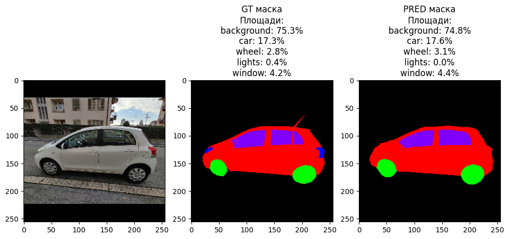

# Classification of the Simpsons
---
The application is designed for editing a car: changing the color of the body, lights, windows and wheels
Link to the website - [web application](https://car-segmentation.streamlit.app/)


The car-segmentation dataset was taken from Kaggle - [dataset](https://www.kaggle.com/datasets/intelecai/car-segmentation)

## Some examples of the inference model



## How to run it on your own machine
---
1. You must have python 3 installed in any version.
2. Clone this repository to yourself
   ```
   $ git clone https://github.com/MakhmudovMels/car-segmentation.git
   ```
3. Use the cd command to navigate to the created folder
   ```
   $ cd car-segmentation
   ```
4. Install the requirements
   ```
   $ pip install -r requirements.txt
   ```
5. Run the app
   ```
   $ streamlit run web.py
   ```
